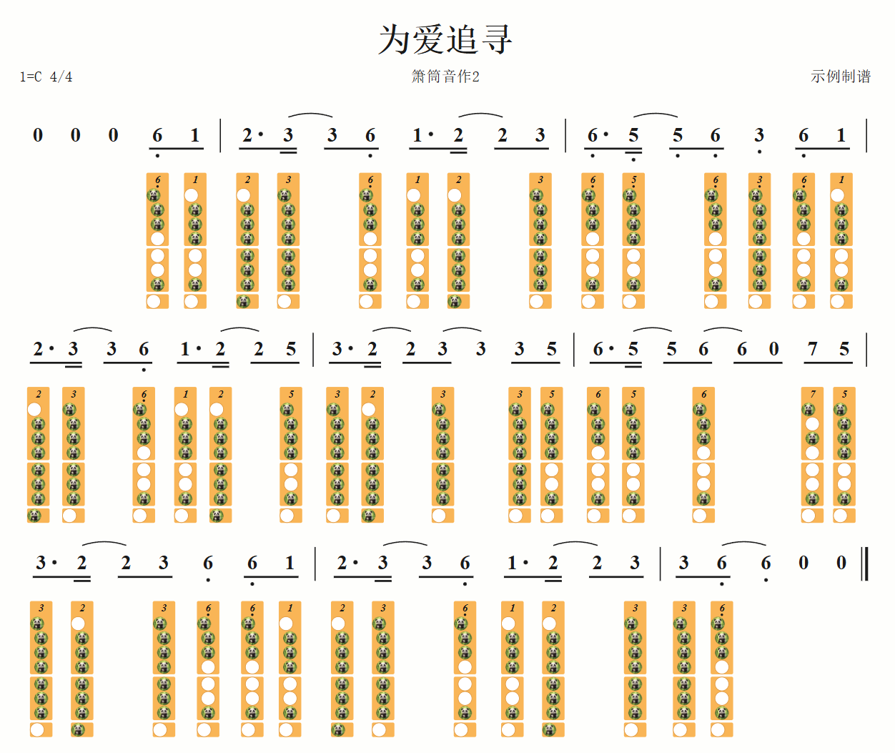

# 箫谱生成器

用文本写谱，自动排版成**简谱 + 八孔箫洞洞谱**，导出带水印的 PNG / SVG / PDF。
纯前端，无后端，全部在浏览器里完成。

```
0 0 |
1.隐 (2去) (1了 6_离) 5_别 |
(3_提 5_笔) (3却 2难) 1写 - |
```

↑ 左边这样写，右边就实时出谱：上排简谱、中间歌词、下排每个音对应的指法孔位图。



---

## 这东西解决什么问题

手工画洞洞谱很费劲：每个音都要查「这个音在这支箫上按哪几个孔」，
换一次「筒音作X」就得从头再来一遍。

本项目把这件事变成纯粹的查表：

> 箫的**按法与实际音高是物理固定的**，「筒音作X」只换唱名标签，不改指法本身。
> 所以全系统只有**一张指法表**，按「距筒音多少个半音」索引；
> 换筒音作法只是把索引整体平移，表本身纹丝不动。

你只要在谱头选好**箫调**和**筒音作**，每个音的指法就自动查出来了。
调号也由这两项推导（G 调箫 + 筒音作 2 → `1=C`），不用自己算。

---

## 快速开始

```bash
npm install
npm run dev      # 打开 http://localhost:5173
```

首次打开会自动弹出使用教程，里面每条规则都配了「DSL 文本 + 渲染效果」对照示例。
顶栏「样例」下拉可以载入两首完整曲子，照着改是最快的上手方式。

```bash
npm test         # 168 个单测
npm run build    # 产出 dist/
```

开发辅助：`npx tsx scripts/render-png.mts` 把样例渲染成 PNG 到 `out/`，方便和原图逐格比对。

---

## DSL 速查

完整说明在应用内的**教程弹窗**里（顶栏「教程」），这里只列骨架。

### 谱头

界面上是表单，底层是键值对：

| 字段 | 必填 | 说明 |
|---|---|---|
| `标题:` | 是 | |
| `副标题:` `制谱:` | 否 | |
| `箫调:` | 是 | 箫的调（筒音作 5 时的调），如 `G` / `F` |
| `筒音作:` | 是 | 筒音的唱名，`1`–`7` 或 `b7` |
| `拍号:` | 是 | 如 `4/4` |
| `调号:` | 否 | 留空则由「箫调 + 筒音作」自动推导 |
| `速度:` | 否 | 全曲基准 BPM，留空则谱头不显示 |

### 正文

| 记法 | 含义 |
|---|---|
| `1`–`7` / `0` | 唱名 / 休止符 |
| `5^` `5_` | 高 / 低八度，可叠加（`5^^`） |
| `#5` `b7` `n5` | 升 / 降 / 还原 |
| `1.` | 附点 |
| `-` | 延音横线 |
| `( )` | **每套一层加一条减时线**，同时决定梁的分组 |
| `~` | 延音线，与下一个同音相连（可跨梁、跨小节） |
| `{ }` | 圆滑线 |
| `< >` | 倚音，写在主音前 |
| `3:{ }` | 三连音（通用 `N:{ }`） |
| `\|` `\|\|` `\|:` `:\|` `[1.` | 小节线 / 终止线 / 反复 / 房子 |
| `\rit` `\tempo=88` `\dc` `\fine` … | 反斜杠命令：变速与段落记号 |
| 音符后紧跟中文 | 歌词，如 `1隐`、`5离别`、`5"la la"` |
| `//` | 整行注释 |

两条设计上的取舍：

- **括号 = 减时线层数**，而不是「八分/十六分」这类字面时值。
  嵌套几层，数字下面就有几条横线，和简谱的读法天然一致。
- **中文只用于歌词**，记号一律 ASCII。正文里出现汉字时含义唯一，
  不会有「这两个字到底是词还是命令」的歧义。
  记号不用背——在正文里打一个 `\` 就弹出命令面板，↑↓ 选、Enter 插入。

---

## 验收

以两首实际曲目的原谱图为基准，**逐格核对**：

| 曲目 | 覆盖的特性 |
|---|---|
| 《落了白》 | 歌词、倚音、圆滑线、终止线、页脚 |
| 《为爱追寻》 | 无歌词、大量延音线、附点八分 + 十六分节奏 |

两首的 DSL 在 `src/samples/index.ts`，逐音对照原图录入。

> 用作核对基准的**原谱图是第三方制谱作品，未收录进本仓库**。
> 测试只依赖 `src/samples/index.ts` 里的 DSL 和 `八孔洞箫指法表.md`，不读那些图，
> 所以克隆下来照样跑得通。
《为爱追寻》各小节应画的指法列数 `[2,6,6,6,5,5,6,6,2]` 已固化成单测。

指法表另有一条单测会**重新解析 `八孔洞箫指法表.md` 原文**与代码里的表逐格比对，
防止转录漂移。

> 与原图唯一的有意差异：《落了白》开头原图把「2 拍引子 + 4 拍乐句」
> 挤在一个小节里且未画小节线，录入时补上了那条小节线。

---

## 项目结构

核心是一条**纯函数管线**，与 UI 完全解耦，所以能直接对它写单测：

```
DSL 文本 → tokenize → parse(AST) → validate → layout → SVG
```

```
src/
  core/
    commands.ts      反斜杠命令表（分词器/补全面板/教程共用同一份）
    tokenize.ts      分词
    parser.ts        AST
    validate.ts      拍数、音域、调号一致性校验
    layout.ts        布局模型：竖向分带、折行、两端对齐、分页
    dsl.ts           谱头表单 ↔ DSL 文本互转
    pipeline.ts      管线入口
    fingering/
      table.ts       指法表（32 音位 × 8 孔，Uint8Array）
      derive.ts      半音换算、查表、调号推导
  render/
    ScoreSvg.tsx     布局模型 → SVG（不做任何计算决策）
    panda.ts         孔位图标（内联 data URI）
  components/        谱头表单、正文编辑器、教程弹窗、导出弹窗
  export/            PNG / SVG / PDF
tests/               168 个单测
需求文档.md          完整 PRD，含所有设计决策的来由
八孔洞箫指法表.md    权威指法表原始数据
```

几个实现上值得一提的点：

- **竖向位置全部按内容实测算出**，不写死常量。减时线条数、八度点个数、
  有无变速记号，都会把相邻的带顶开——否则减时线多一条就会压到歌词上。
- **指法表用 `Uint8Array` 存**（`0● 1○ 2◐ 3◎`），源字面量是每孔一行的数字串。
- **熊猫图标只内联一次**，孔位用 `<pattern>` 引用。整页上百个孔，
  每个孔各带一份 data URI 的话 SVG 会膨胀到几 MB。
- **PDF 内嵌 3x 位图而非矢量**：jsPDF 内置字体不含中文字形，
  走矢量会让标题和歌词整片乱码。

---

## 技术栈

Vite + TypeScript + React 18，渲染用原生 SVG，导出用 canvas 光栅化 + jsPDF，
测试用 Vitest。无后端，无运行时网络请求。

---

## 许可

[Apache License 2.0](LICENSE)。

---

## 待办

- 圆滑线跨行断开续接的细节打磨
- D.C. / D.S. / Coda 的实际播放顺序展开（目前只渲染记号）
- 多段歌词（`词2:` / `词3:`）
- 六孔箫、笛等其它乐器——指法数据与渲染逻辑已经解耦，加一张表即可
